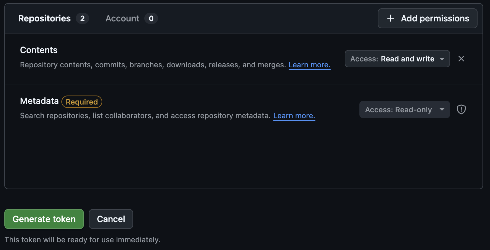
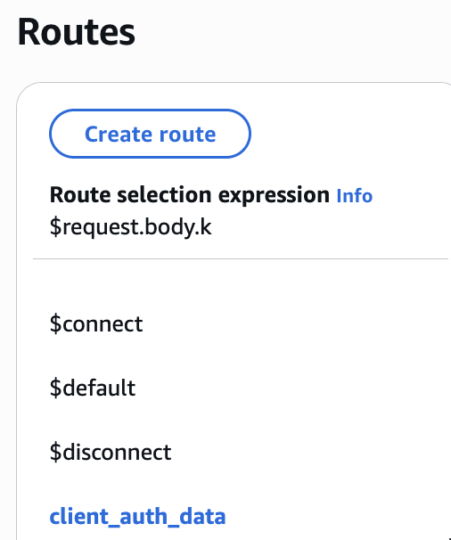
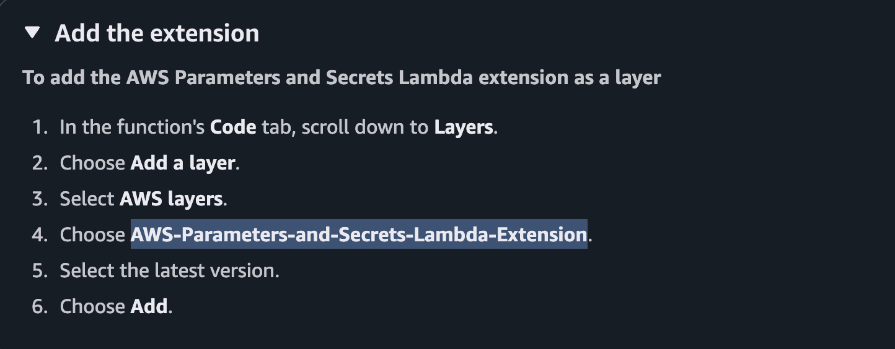

## Item Listing App

Hi! This application is intended for folks to post and share free items they have around town. I sucessfully accomplished every element of the front-end user-interface I had intended to implement, but only certain parts of the AWS or GitHub backend are partly functional:

- We use AWS API Gateway to generate a Websocket API that cooresponds with a Lambda function.
- Right now, that function directly takes the username and password submitted, and stores them.
- The username and password are stored in the AWS Secrets Manager

As a proof of concept, a new "Lost Cat" is added to a random location on the map whenever a new user is created.

- This is done to simulate the same functionality as manual addition of items by the users
- This is accomplished by AWS lambda using a GITHUB_TOKEN to update this very github repo.

  
- Here's a 2-3 minute video: https://youtube.com/shorts/B1_Ls2yMtnA
- Here's an 8+ minute video: https://youtu.be/1rVc3uZ53qI

### Setup

- I've created [a fine-grained token][new-token] with `repo` scope for this repo.



- I've added that token as `GITHUB_TOKEN` in AWS Secrets Manager.
- I've created an AWS Lambda function with a WebSocket API Gateway.
- In API Gateway, I use a "route key" to route each Websocket message.
- I enabled two-way communication



- I added an AWS Lambda extension to allow AWS Parameters and Secrets



- I added the follolwing permissions to my lambda execution role: 

```
{
    "Version": "2012-10-17",
    "Statement": [
        {
            "Sid": "VisualEditor0",
            "Effect": "Allow",
            "Action": [
                "secretsmanager:GetRandomPassword",
                "secretsmanager:*",
                "secretsmanager:ListSecrets",
                "secretsmanager:BatchGetSecretValue"
            ],
            "Resource": "*"
        },
        {
            "Sid": "VisualEditor1",
            "Effect": "Allow",
            "Action": [
                "secretsmanager:GetSecretValue",
                "secretsmanager:*"
            ],
            "Resource": "arn:aws:secretsmanager:us-east-1:111122223333:secret:SECRET_NAME"
        },
        {
            "Sid": "VisualEditor2",
            "Effect": "Allow",
            "Action": "secretsmanager:*",
            "Resource": "arn:aws:secretsmanager:us-east-1:111122223333:secret:SECRET_NAME"
        },
        {
            "Sid": "VisualEditor3",
            "Effect": "Allow",
            "Action": [
                "execute-api:*",
                "execute-api:Invoke"
            ],
            "Resource": "arn:aws:execute-api:us-east-2:123456789012:2136mdeg35/TEST/@connections/*"
        }
    ]
}
```

[new-env]: https://github.com/tvquizphd/101.boston/settings/environments/new
[new-token]: https://github.com/settings/personal-access-tokens/new
